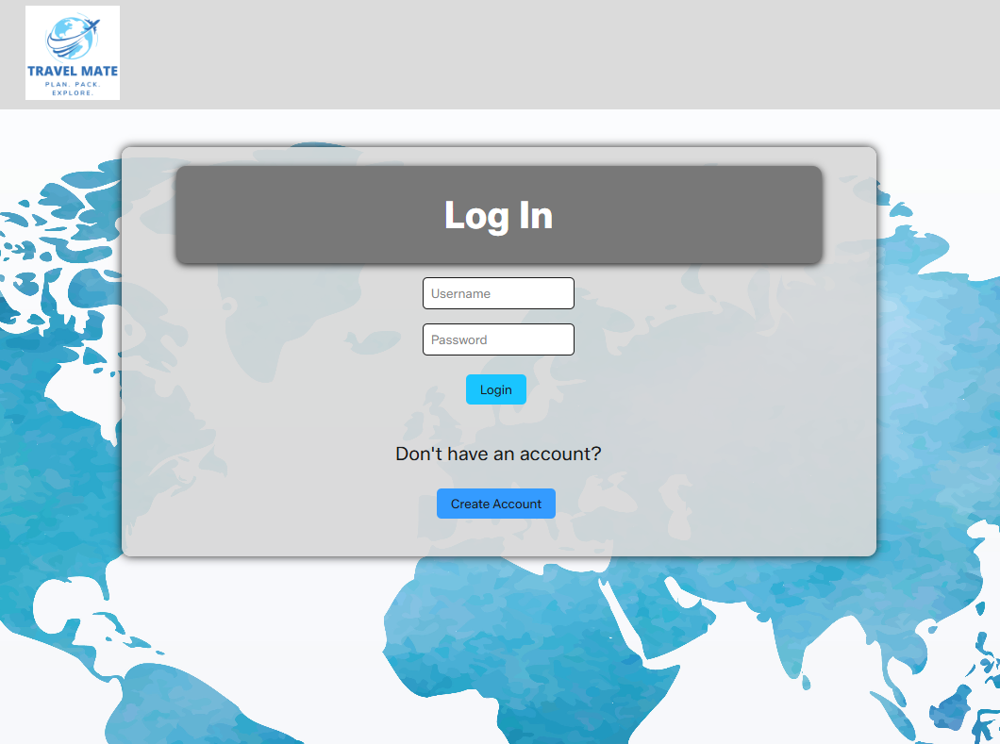
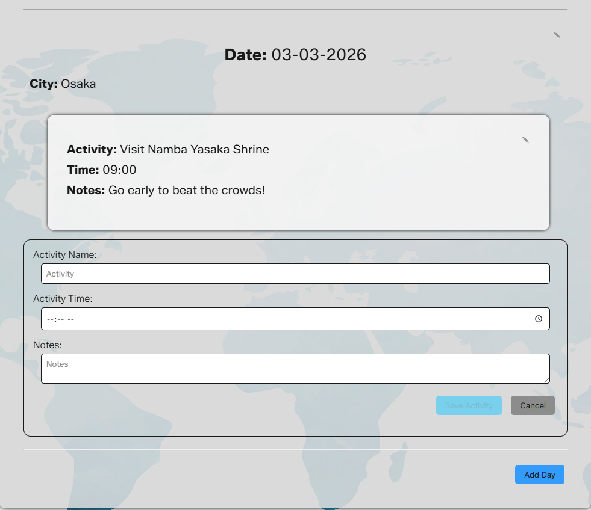
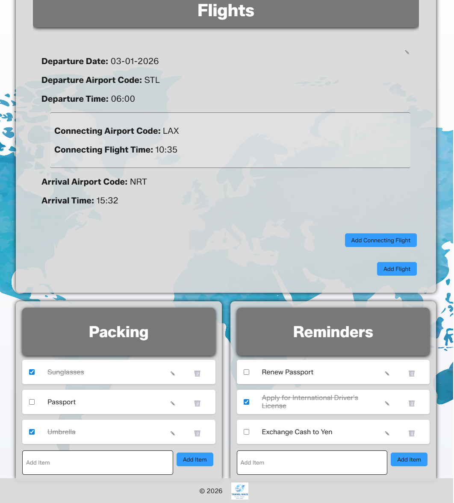

# 🌍 TravelMate – Full-Stack Travel Planning Application

<p align="center">
  
  
  
  
  
  
  
</p>

---

## 📌 About the Project

TravelMate is a full-stack web application developed as a capstone project for the LaunchCode Software Development program. It provides a seamless platform for planning trips, organizing itineraries, and managing travel logistics in one place.

The application uses a modern **ReactJS frontend** with modular components and a **Java Spring Boot backend** connected to a **MySQL relational database** for persistent data storage.

---

## ✨ Features

### 🗺️ Itinerary Management
- Organize trips by day and activity  
- Save and edit travel plans  

### ✈️ Flight Tracking
- Store flight details and connections  
- Centralize travel logistics  

### 📝 List Management
- Create trip-specific lists  
- Perfect for packing, notes, and reminders

 ### 🔄 Full CRUD Functionality
- **Create** – Add new trips, itineraries, flights, and lists  
- **Read** – View all saved travel data in an organized interface  
- **Update** – Edit existing trips, activities, and details  
- **Delete** – Remove trips, flights, or list items 

### 📱 Responsive Design
- Optimized for desktop, tablet, and mobile  
- Smooth transitions across breakpoints  

---

## 🎨 Key Visuals

### 🔗 Wireframes  

<a href="https://www.figma.com/design/79YkvS4SDtM7uXZbrXRerT/Wireframing--Copy---Copy-?node-id=77-432&t=Za7HqqHbMUrFM5C1-1" alt="Link to Wireframes">View Wireframes<a>  

### 👀 UI Preview

<details>
<summary>Login Page</summary>



</details>

<details>
<summary>Itinerary / Activity Page</summary>



</details>

<details>
<summary>Flights and Lists Page</summary>



</details>

## 🛠️ Tech Stack

### Front End
- **JavaScript** – Core language for dynamic UI behavior  
- **React** – Component-based UI architecture  
- **React Router** – Client-side navigation  
- **CSS** – Styling and responsive design  

### Back End
- **Java** – Backend programming language  
- **Spring Boot** – REST API and server framework  
- **MySQL** – Relational database  

### APIs
- **Exchange API** – Currency conversion for travel planning  

---

## ⚙️ Installation

### 🔽 Clone the Repository

```bash
git clone https://github.com/afneal/Unit2CapstoneTravelMate-Alex-N.git
cd Unit2CapstoneTravelMate-Alex-N
```

---

## 🖥️ Back End Setup (Spring Boot)

1. Open the project in IntelliJ IDEA (recommended)

2. Navigate to backend directory (if using terminal):
```bash
cd travel-mate-backend
```

3. Set up MySQL database:
```text
travel_mate
```

4. Configure `application.properties`:
```properties
spring.datasource.url=jdbc:mysql://localhost:3306/travel_mate
spring.datasource.username=YOUR_USERNAME
spring.datasource.password=YOUR_PASSWORD

spring.jpa.hibernate.ddl-auto=update
spring.jpa.show-sql=true
```

5. Run the backend server:
```bash
./mvnw spring-boot:run
```

### ✅ Backend Notes
- Hibernate automatically creates database tables   
- Data can be added through the application  
- Ensure MySQL is running before starting  

---

## 🌐 Front End Setup (React)

1. Navigate to frontend:
```bash
cd frontend
```

2. Install dependencies:
```bash
npm install
```

3. Run the app:
```bash
npm run dev
```

4. Open browser:
```text
http://localhost:5173
```

---

## 🗄️ Database Structure

🔗 ERD Diagram:  
https://lucid.app/lucidchart/50bc49d4-72cd-406d-9270-c398daaee0e5/edit?invitationId=inv_78917427-f6f6-45ab-9900-f60ba8d508c3&page=0_0#

### Overview
- MySQL relational database  
- Managed using Hibernate ORM  
- Entity-based schema generation  

---

## 🚀 Future Features

### 🤖 AI Recommendations
- Generate trip schedules based on:
  - Seasonal trends  
  - Weather conditions  
  - Popular destinations  

- Provide packing suggestions based on:
  - Climate  
  - Walkability  
  - Trip duration  

---

### 🔐 Security Improvements
- Implement JWT-based authentication  
- Strengthen user data protection  

---

### 👤 User Personas
- Standard users  
- Travel consultants  

Enhancements:
- Sort trips by customer name  
- Filter by region, country, or year  

---

### 📄 Export Functionality
- Export trip data as PDF  
- Enable offline access  

---

### 🧩 Useful Widgets
- Time zone converter  
- Real-time weather display  

---

## 🧠 Key Learnings

- Full-stack development with React and Spring Boot  
- Designing relational databases with MySQL  
- API integration and data flow management  
- Building responsive, modular UI components  

---

## 🚧 Challenges

- Managing complex relational data  
- Frontend-backend integration  
- Ensuring responsive design consistency  

---

## 🐞 Known Issues

- Occasional slow API responses  
- Limited validation in some forms  
- Minor UI issues on certain screen sizes  

---

## 📊 Project Status

🚧 In Progress – actively being enhanced  

---

## 👤 Author

**Alex N.**  
GitHub: https://github.com/afneal  

---
